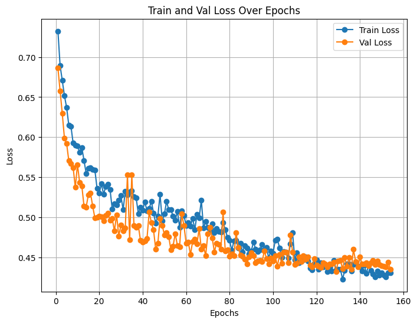

# Dog or Dough 🐕🍞

A multi-class image classification project that in the current implementation distinguishes between dogs and bread (dough) using a custom neural network implementation built from scratch with NumPy. This project demonstrates deep learning fundamentals including forward/backward propagation, optimization algorithms, and regularization techniques.

## 📋 Table of Contents

- [Overview](#-overview)
- [Features](#-features)
- [Project Structure](#-project-structure)
- [Installation](#-installation)
- [Usage](#-usage)
- [Architecture](#️-architecture)
- [Results](#-results)

## 🎯 Overview

This project implements a complete deep learning pipeline for multi-class image classification:

- **Task**: Classify images as either "dog" or "dough"
- **Approach**: Custom neural network built from scratch using only NumPy
- **Input**: RGB images resized to 64×64 pixels
- **Output**: Multi-class classification with confidence scores

## ✨ Features

- **Custom Neural Network**: Fully implemented from scratch (no deep learning frameworks)
- **Adam Optimizer**: Adaptive learning rate optimization with momentum
- **Regularization**: Dropout and L2 weight decay to prevent overfitting
- **Data Augmentation**: On-the-fly augmentation using Albumentations (horizontal flip, rotation, brightness/contrast)
- **Early Stopping**: Prevents overfitting by monitoring validation loss
- **Learning Rate Decay**: Adaptive learning rate reduction on plateau
- **Comprehensive Metrics**: Accuracy, precision, recall, and F1-score (per-class and macro-averaged)
- **Model Checkpointing**: Automatic saving of best models during training
- **Inference & Evaluation**: Separate modes for inferencing against or without ground truths.

## 📁 Project Structure

```
Dog-Or-Dough/
├── src/
│   ├── model.py              # NeuralNetwork class implementation
│   ├── train.py              # Training script with Trainer class
│   ├── eval.py               # Evaluation and inference script
│   └── helpers/
│       ├── activations.py    # ReLU and Softmax functions
│       ├── utils.py          # Data loading, preprocessing, augmentation
│       └── metrics.py        # Evaluation metrics and plotting
├── data/
│   ├── train/                # Training images (dog/, dough/)
│   ├── val/                  # Validation images (dog/, dough/)
│   └── test/                 # Test images (dog/, dough/)
├── checkpoints/
│   └── Exp6/                 # Experiment 6 checkpoints and results
│       ├── model_parameters_*.npz
│       └── loss_curve.png
└── README.md
```

## 🚀 Installation

### Prerequisites

- Python 3.7+
- NumPy
- OpenCV (cv2)
- Matplotlib
- tqdm
- Albumentations

### Setup

1. Clone the repository:

```bash
git clone <repository-url>
cd Dog-Or-Dough
```

2. Create a virtual environment (recommended):

```bash
python -m venv env
source env/bin/activate  # On Windows: env\Scripts\activate
```

3. Install dependencies:

```bash
pip install numpy opencv-python matplotlib tqdm albumentations
```

## 💻 Usage

### Training

Train a new model by modifying the configuration in `src/train.py`:

```python
from model import NeuralNetwork
from train import Trainer
from helpers.utils import get_augmentation_pipeline

# Define model architecture
NN = NeuralNetwork(
    layers=[128, 64, 32, 16, 2],      # Hidden layers + output layer
    input_size=(64, 64),               # Input image dimensions
    learning_rate=1e-4,                # Initial learning rate
    weight_decay=1e-5,                 # L2 regularization strength
    dropout=[0.3, 0.2, 0.1, 0.0],      # Dropout rates per layer
)

# Create trainer
trainer = Trainer(
    NN=NN,
    epochs=200,                        # Maximum epochs
    batch_size=32,                     # Batch size
    patience=25,                       # Early stopping patience
    use_lr_decay=True,                 # Enable learning rate decay
    lr_patience=10,                    # LR decay patience
    min_lr=1e-6,                       # Minimum learning rate
    experiment_name="Exp6",            # Experiment name
    aug_pipeline=get_augmentation_pipeline()  # Data augmentation
)

# Start training
trainer.train()
```

Run training:

```bash
cd src
python train.py
```

### Evaluation

Evaluate the model against the ground truths of the test data:

1. Edit `src/eval.py` to set the model path:

```python
model_path = os.path.join(script_dir, "../checkpoints/Exp6/model_parameters_153.npz")
```

2. Set mode to `"evaluate"`:

```python
mode = "evaluate"
```

3. Run evaluation:

```bash
python eval.py
```

### Inference

Perform inference on new images:

1. Edit `src/eval.py`:

```python
mode = "inference"
```

2. Place images in `data/test/` or modify the image paths in the script

3. Run inference:

```bash
python eval.py
```

## 🏗️ Architecture

### Current Neural Network Structure

**Best Experiment:**

- **Input Layer**: 64×64×3 = 12,288 features
- **Hidden Layer 1**: 128 neurons (ReLU, Dropout 0.3)
- **Hidden Layer 2**: 64 neurons (ReLU, Dropout 0.2)
- **Hidden Layer 3**: 32 neurons (ReLU, Dropout 0.1)
- **Hidden Layer 4**: 16 neurons (ReLU, No Dropout)
- **Output Layer**: 2 neurons (Softmax)

**Total Trainable Parameters**: ~1.6M

## 🎯 Results

Best model's performance and additional details.

### Training Stats:

**Losses**
| Dataset | Loss |
|--------------|--------|
| Train | 0.4310 |
| Validation | 0.4354 |

---

**Overall Accuracy**  
Accuracy: 0.8052

---

**Class-wise Metrics**  
| Class | Precision | Recall | F1-score |
|-------|-----------|--------|----------|
| dog | 0.7606 | 0.8328 | 0.7950 |
| dough | 0.8493 | 0.7824 | 0.8145 |

---

**Macro Metrics**  
| Metric | Value |
|-----------------|--------|
| Macro Precision | 0.8049 |
| Macro Recall | 0.8076 |
| Macro F1 | 0.8047 |

---

### Experiment Hyperparameters:

| Component          | Parameter             | Value                             |
| ------------------ | --------------------- | --------------------------------- |
| **Neural Network** | Layers                | [128, 64, 32, 16, 2]              |
|                    | Input size            | (64, 64)                          |
|                    | Learning rate         | 1e-4                              |
|                    | Weight decay          | 1e-5                              |
|                    | Dropout               | [0.3, 0.2, 0.1, 0.0]              |
| **Trainer**        | Use LR decay          | True                              |
|                    | LR patience           | 10                                |
|                    | Patience              | 25                                |
|                    | Minimum LR            | 1e-6                              |
|                    | Augmentation pipeline | See `get_augmentation_pipeline()` |

> **Note:** Dropout values correspond to each hidden layer except the output layer. The augmentation pipeline is applied during training to increase data diversity.

### Loss Curve:


